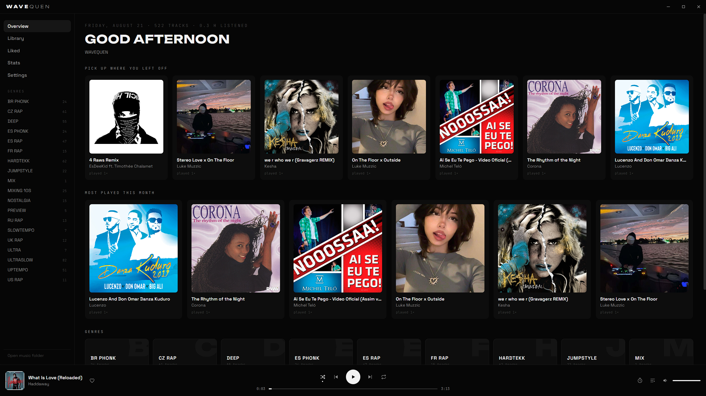

<div align="center">

# 🎵 Wavequen

**A minimal desktop music player for the files you already own.**

Point it at a folder, and every subfolder becomes a genre playlist.
Black and white interface — the only colour comes from your album art.

[](LICENSE)


Nothing is uploaded, nothing is streamed, nothing is moved or renamed on your disk.

</div>

---

## Contents

- [Features](#features)
- [Screenshots](#screenshots)
- [Install](#install)
- [Where things live](#where-things-live)
- [Keyboard](#keyboard)
- [Discord Rich Presence](#discord-rich-presence)
- [Build](#build)
- [Development](#development)
- [About this project](#about-this-project)
- [License](#license)

---

## Features

| | |
|---|---|
| 📁 **Folder playlists** | Each subfolder of your music folder becomes a genre, picked up automatically |
| 🌊 **Live visualiser** | Waveform strip in the player bar, full-screen view on the album art |
| 📊 **Listening stats** | Hours, plays, streak, top tracks, artists and genres |
| 🖼️ **Album art** | Fetched from Deezer and iTunes and cached locally — no API key needed |
| 🎮 **Discord Rich Presence** | Shows what you're playing, with a live progress bar |
| 🔁 **Queue, shuffle, repeat** | Liked tracks, sleep timer, and hardware media key support |
| 👀 **Live folder watching** | Drop a file in, it shows up without a restart |

**Supported formats:** `wav` `mp3` `m4a` `flac` `ogg` `opus` `aac`

## Screenshots

<!--
  TODO: nahraď tyhle placeholdery reálnými screenshoty z aplikace.
  Doporučený postup:
    1. slož si obrázky do /assets/screenshots/
    2. přejmenuj podle názvu níže a nahraď odkaz
  Např: 
-->

| Player | Visualiser |
|---|---|
| *(screenshot player baru)* | *(screenshot fullscreen vizualizéru)* |

| Stats | Discord Rich Presence |
|---|---|
| *(screenshot statistik poslechu)* | *(screenshot Discord profilu s aktivitou)* |

## Install

Grab the installer or the portable build from
[Releases](https://github.com/Dinouseg/wavequen/releases), or run from source:

```bash
git clone https://github.com/Dinouseg/wavequen.git
cd wavequen
npm install
npm start
```

On the first run, Wavequen asks for your music folder. That's the whole setup.

## Where things live

| What | Where |
|---|---|
| Your music | the folder you chose during setup (Settings → Change) |
| Settings, stats, liked tracks, cached covers | `%APPDATA%/Wavequen` · `~/.config/Wavequen` · `~/Library/Application Support/Wavequen` |

Track titles and artists are read from file names (`Artist - Title.wav`). Missing artists are filled
in from Deezer or iTunes when a match is found, and stored in `data/overrides.json` — edit that file
if a guess is wrong.

## Keyboard

| Key | Action |
|---|---|
| `Space` | play / pause |
| `←` `→` | seek 5 seconds |
| `/` | search |
| `Esc` | close now playing or queue |

## Discord Rich Presence

Wavequen ships without its own Discord application, so it uses one you create yourself —
it takes about two minutes.

### 1. Create a Discord application

1. Open the [Discord Developer Portal](https://discord.com/developers/applications) and log in
   with your normal Discord account.
2. Click **New Application** (top right).
3. Give it a name — this is exactly what will show up on your profile under "Playing", so name it
   something like `Wavequen` or `Music`.

<!-- screenshot: New Application dialog -->

### 2. Copy the Application ID

1. On the application's **General Information** page, find **Application ID**.
2. Click **Copy**.

<!-- screenshot: General Information page with Application ID highlighted -->

### 3. Paste it into Wavequen

1. Open Wavequen → **Settings** → **Discord Rich Presence**.
2. Paste the ID into the field and enable the toggle.

<!-- screenshot: Wavequen settings, Discord Rich Presence field -->

Presence stays off until an ID is set, and is silently skipped when the Discord desktop app isn't
running.

### 4. (Optional) Add the fallback artwork

For the default cover and the play/pause badge to show up:

1. In the Developer Portal, go to **Rich Presence → Art Assets**.
2. Upload three images named exactly:
   - `wavequen` — fallback cover art
   - `play` — badge shown while playing
   - `pause` — badge shown while paused

<!-- screenshot: Art Assets upload page -->

## Build

```bash
npm run dist          # installer + portable .exe on Windows
npm run dist:linux    # AppImage
npm run dist:mac      # dmg
```

Artefacts land in `dist/`. Cross-building for macOS requires a Mac.

Pushing a `v*` tag builds all three platforms on GitHub Actions and attaches them to a Release
(`.github/workflows/release.yml`):

```bash
git tag v1.0.0
git push origin v1.0.0
```

On Windows, electron-builder unpacks a signing toolchain that contains symlinks, which needs
**Developer Mode** on (Settings → Privacy & security → For developers) or an elevated terminal.
Without it the build stops at `Cannot create symbolic link`. For a quick test build,
`npx electron-builder --win --config.win.signAndEditExecutable=false` skips that step, at the cost of
the executable keeping Electron's default icon and version metadata.

## Development

```bash
npm test    # file name parsing and library path guard
npm start
```

- `main.js` — window, config, library scan, the `wq://` file protocol, Discord presence
- `preload.js` — the IPC surface exposed to the renderer
- `app.js` — renderer: views, playback, queue, visualiser
- `lib/scan.js` — folder scan, file name parsing, WAV duration
- `lib/cover.js` — album art and artist lookup

The renderer runs with context isolation and web security on; audio is served through the custom
`wq://` protocol, which only ever reads audio files inside your music folder.

## About this project

Wavequen is a solo, hobby-scale project — parts of the code were written with AI assistance
and then reviewed and adjusted by hand. It hasn't been tested across every setup, so you may
run into rough edges or the occasional bug, especially on macOS/Linux builds. Issues and pull
requests are welcome.

## License

MIT — see [LICENSE](LICENSE).
